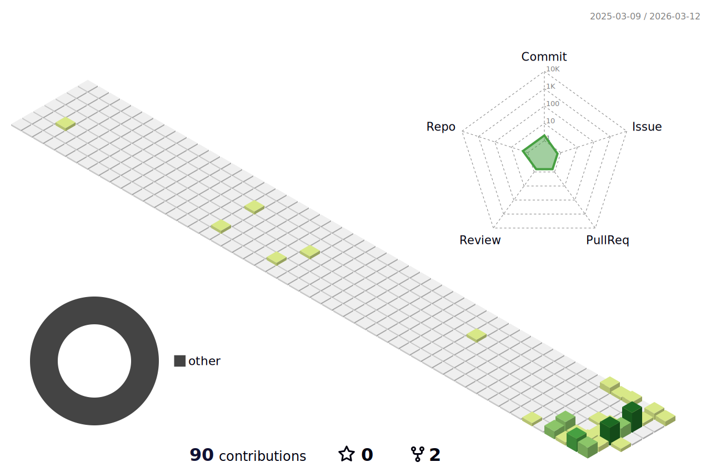

  

  
 👀 I’m interested in building custom rom, making websites
   
 📫 How to reach me [TG: @AssGuardGod]

  

  

 

 

## skills:

  

 

<!---
niteshagrawal/niteshagrawal is a ✨ special ✨ repository because its `README.md` (this file) appears on your GitHub profile.
You can click the Preview link to take a look at your changes.
--->
